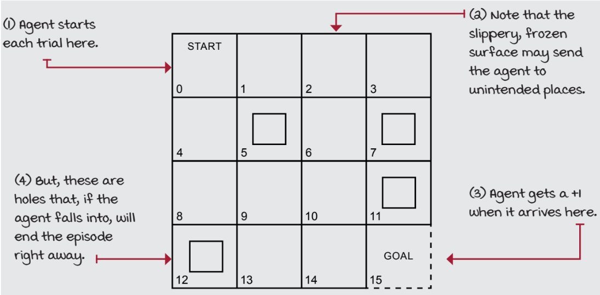

# EXPERIMENT 05:MONTE CARLO CONTROL ALGORITHM

## AIM:
To develop a Python program to find the optimal policy for the given RL environment using the Monte Carlo algorithm.
## PROBLEM STATEMENT:
A 4*4 frozen lake environment is taken into consideration where there are 4 holes and 1 goal which is considered as terminal state.It is stochastic environment and the transition probability varies according to the actions taken.
### State Space:
{0,1,2,3,4,5,6,7,8,9,10,11,12,13,14,15}
### Action space:
{Left[0],Right[1],Up[2],Down[3]}
### Transition probability:
The transition probabilities for the problem statement is:  
* 33.33% - The agent moves in intended direction.  
* 66.66% - The agent moves in orthogonal direction.  
### Reward:
To reach state 15 (Goal) : +1 otherwise : 0
### Graphical Representation:

## MONTE CARLO CONTROL ALGORITHM
1. Initialize Q-table and tracking array.
2. Create schedules for alpha and epsilon decay.
3. For each episode:
   - Generate a trajectory.
   - Create a visited state-action array.
   - For each time step in the trajectory:
     - If using first-visit MC and the state-action pair is visited, skip.
     - Calculate the return G.
     - Update Q-values based on the return.
4. Calculate value function and policy from the final Q-table.
5. Return Q-table, value function, and policy.
6. The `select_action` function uses epsilon-greedy action selection.
7. Iterate over episodes and update Q-values based on Monte Carlo returns.

## PROGRAM:
### MONTE CARLO FUNCTION:
```python
import numpy as np
from tqdm import tqdm

def mc_control(env, gamma=1.0, init_alpha=0.5, min_alpha=0.01, alpha_decay_ratio=0.5,
               init_epsilon=1.0, min_epsilon=0.1, epsilon_decay_ratio=0.9,
               n_episodes=3000, max_steps=200, first_visit=True):

    # Get the number of states and actions
    nS, nA = env.observation_space.n, env.action_space.n

    # Create an array for discounting
    disc = np.logspace(0, max_steps, num=max_steps, base=gamma, endpoint=False)

    def decay_schedule(init_value, min_value, decay_ratio, n):
        return np.maximum(min_value, init_value * (decay_ratio ** np.arange(n))

    # Create schedules for alpha and epsilon decay
    alphas = decay_schedule(init_alpha, min_alpha, alpha_decay_ratio, n_episodes)
    epsilons = decay_schedule(init_epsilon, min_epsilon, epsilon_decay_ratio, n_episodes)

    # Initialize Q-table and tracking array
    Q = np.zeros((nS, nA), dtype=np.float64)
    Q_track = np.zeros((n_episodes, nS, nA), dtype=np.float64)

    def select_action(state, Q, epsilon):
        return np.argmax(Q[state]) if np.random.random()>epsilon else np.random.randint(nA)

    for e in tqdm(range(n_episodes), leave=False):
        # Generate a trajectory
        traj = gen_traj(select_action, Q, epsilons[e], env, max_steps)
        visited = np.zeros((nS, nA), dtype=np.bool)

        for t, (state, action, reward, _, _) in enumerate(traj):
            if visited[state][action] and first_visit:
                continue
            visited[state][action] = True

            n_steps = len(traj[t:])
            G = np.sum(disc[:n_steps] * traj[t:, 2])
            Q[state][action] = Q[state][action] + alphas[e] * (G - Q[state][action])

        Q_track[e] = Q

    # Calculate the value function and policy
    V = np.max(Q, axis=1)
    pi = {s: np.argmax(Q[s]) for s in range(nS)}

    return Q, V, pi
```
### POLICY EVALUATION:
```PYTHON
import random
import numpy as np

def probability_success(env, pi, goal_state, n_episodes=100, max_steps=200, seed=123):
    random.seed(seed)
    np.random.seed(seed)
    env.seed(seed)
    results = []

    for _ in range(n_episodes):
        state, done, steps = env.reset(), False, 0
        while not done and steps < max_steps:
            action = pi[state]
            state, _, done, _ = env.step(action)
            steps += 1
        results.append(state == goal_state)

    success_rate = np.sum(results) / len(results)
    return success_rate

def mean_return(env, pi, n_episodes=100, max_steps=200, seed=123):
    random.seed(seed)
    np.random.seed(seed)
    env.seed(seed)
    results = []

    for _ in range(n_episodes):
        state, done, steps = env.reset(), False, 0
        returns = 0.0
        while not done and steps < max_steps:
            action = pi[state]
            state, reward, done, _ = env.step(action)
            returns += reward
            steps += 1
        results.append(returns)

    average_return = np.mean(results)
    return average_return

def results(env, optimal_pi, goal_state, seed=123):
    success_rate = probability_success(env, optimal_pi, goal_state=goal_state, seed=seed)
    avg_return = mean_return(env, optimal_pi, seed=seed)
    
    print(f'Reaches goal {success_rate:.2%}. 
  			Obtains an average undiscounted return of: {avg_return:.4f}.')

goal_state = 15
results(env, optimal_pi, goal_state=goal_state)
```
## OUTPUT:

## RESULT:
Thus a Python program is developed to find the optimal policy for the given RL environment using the Monte Carlo algorithm.